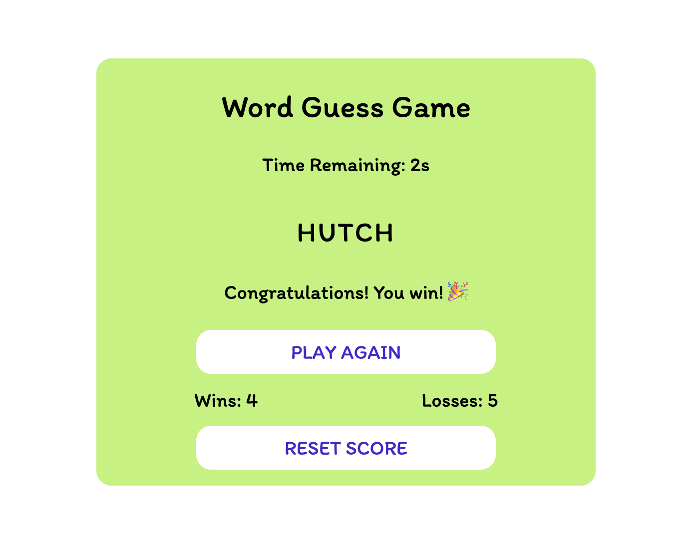

# Word Guess Game

## Description

A word guessing game I'm building with vanilla javacript. After clicking start try guessing letters by pressing keys on your keyboard! Guess within the time limit and you win!

The live site can be viewed [here](https://llourn.github.io/word-guess-game/).

## Table of Contents

- [Installation](#installation)
- [License](#license)
- [Wishlist](#wishlist)

## Installation

No installation required. Just clone the repo and open the index.html file in your browser.

## License

MIT License Copyright (c) 2023 Lorne Cyr

## Wishlist

- Improve the look of the page.
- Add different difficulty levels.
- Add different profiles for shared computers.
- Let user choose which types of words to include (nouns, adverbs, verbs, adjectives).
